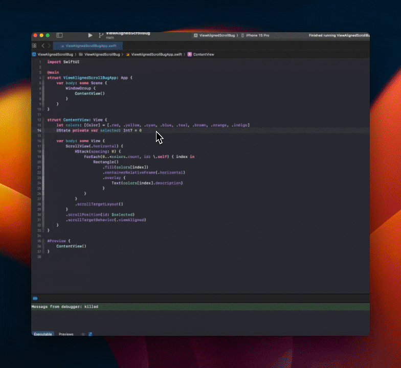

# SwiftUI ScrollView Bug

This repository demonstrates a SwiftUI [`ScrollView`](https://developer.apple.com/documentation/swiftui/scrollview) bug when used with [`.scrollTargetBehavior(.viewAligned)`](). The [scroll position](https://developer.apple.com/documentation/swiftui/view/scrollposition(id:anchor:)) is not being updated on orientation (size) changes.

Tested on:

- Xcode 15.3 (15E204a)
- iOS 17.3.1 iPhone
- iOS 17.4 Simulator



The entire code to replicate this:

```swift
import SwiftUI

@main
struct ViewAlignedScrollBugApp: App {
    var body: some Scene {
        WindowGroup {
            ContentView()
        }
    }
}

struct ContentView: View {
    let colors: [Color] = [.red, .yellow, .cyan, .blue, .teal, .brown, .orange, .indigo]
    @State private var selected: Int? = 0
    
    var body: some View {
        ScrollView(.horizontal) {
            HStack(spacing: 0) {
                ForEach(0..<colors.count, id: \.self) { index in
                    Rectangle()
                        .fill(colors[index])
                        .containerRelativeFrame(.horizontal)
                        .overlay {
                            Text(colors[index].description)
                        }
                }
            }
            .scrollTargetLayout()
        }
        .scrollPosition(id: $selected)
        .scrollTargetBehavior(.viewAligned)
    }
}

#Preview {
    ContentView()
}
```
